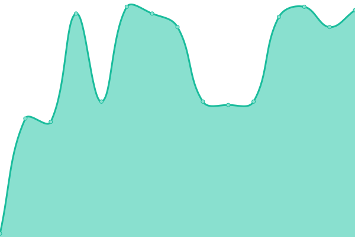
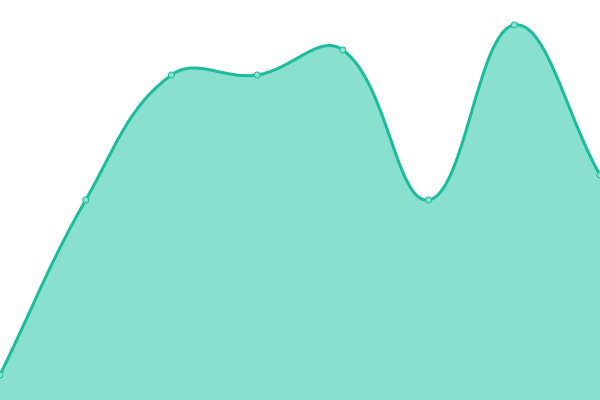
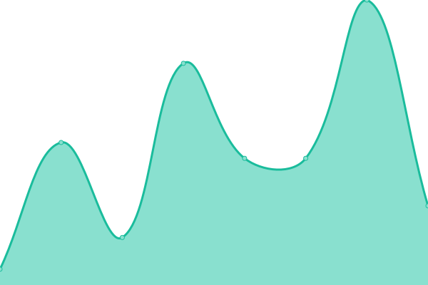

# [📈 Live Status](https://status.subspace.network): <!--live status--> **🟧 Partial outage**

This repository contains the open-source uptime monitor and status page for [subspace](https://subspace.network), powered by [Upptime](https://github.com/upptime/upptime).

With [Upptime](https://upptime.js.org), you can get your own unlimited and free uptime monitor and status page, powered entirely by a GitHub repository. We use [Issues](https://github.com/subspace/status/issues) as incident reports, [Actions](https://github.com/subspace/status/actions) as uptime monitors, and [Pages](https://status.subspace.network) for the status page.

<!--start: status pages-->
<!-- This summary is generated by Upptime (https://github.com/upptime/upptime) -->
<!-- Do not edit this manually, your changes will be overwritten -->
<!-- prettier-ignore -->
| URL | Status | History | Response Time | Uptime |
| --- | ------ | ------- | ------------- | ------ |
|  [Subspace Labs Website](https://www.subspace.network) | 🟥 Down | [subspace-labs-website.yml](https://github.com/subspace/status/commits/HEAD/history/subspace-labs-website.yml) | 

 87ms
     
 | 

<a href="https://status.subspace.network/history/subspace-labs-website">99.99%</a>
    

|  [Spartan Testnet](165.232.157.230) | 🟩 Up | [spartan-testnet.yml](https://github.com/subspace/status/commits/HEAD/history/spartan-testnet.yml) | 

 64ms
     
 | 

<a href="https://status.subspace.network/history/spartan-testnet">100.00%</a>
    

|  [Polkadot-App](dev-polkadotapp.subspace.network) | 🟩 Up | [polkadot-app.yml](https://github.com/subspace/status/commits/HEAD/history/polkadot-app.yml) | 

 46ms
     
 | 

<a href="https://status.subspace.network/history/polkadot-app">100.00%</a>
    

|  [Polkascan-App](dev-polkascan.subspace.network) | 🟩 Up | [polkascan-app.yml](https://github.com/subspace/status/commits/HEAD/history/polkascan-app.yml) | 

 8ms
     
 | 

<a href="https://status.subspace.network/history/polkascan-app">100.00%</a>
    

|  [Development RPC Endpoint](dev-rpc.subspace.network) | 🟩 Up | [development-rpc-endpoint.yml](https://github.com/subspace/status/commits/HEAD/history/development-rpc-endpoint.yml) | 

 9ms
     
 | 

<a href="https://status.subspace.network/history/development-rpc-endpoint">100.00%</a>
    

<!--end: status pages-->

[**Visit our status website →**](https://status.subspace.network)

## 📄 License

- Powered by: [Upptime](https://github.com/upptime/upptime)
- Code: [MIT](./LICENSE) © [subspace](https://subspace.network)
- Data in the `./history` directory: [Open Database License](https://opendatacommons.org/licenses/odbl/1-0/)
