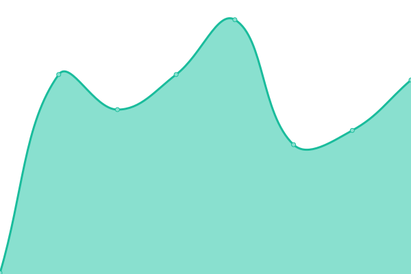
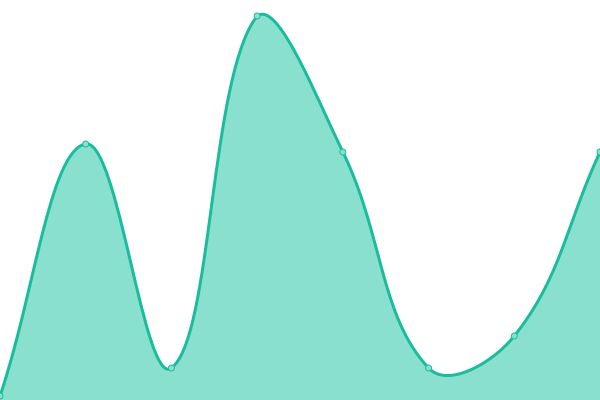
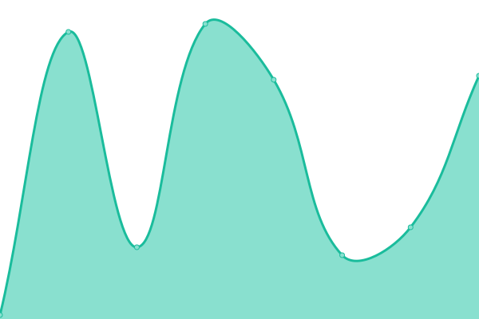
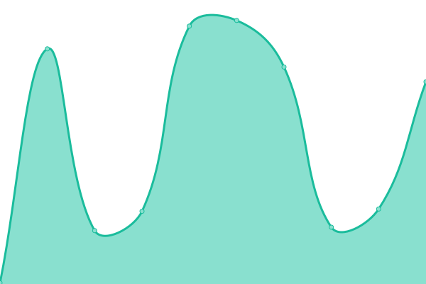
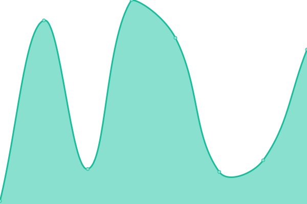
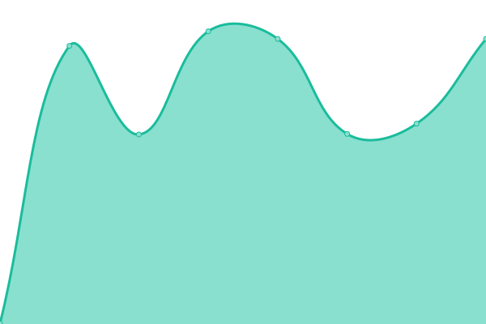
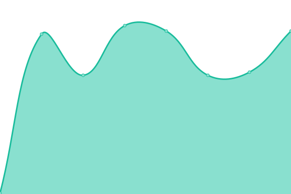
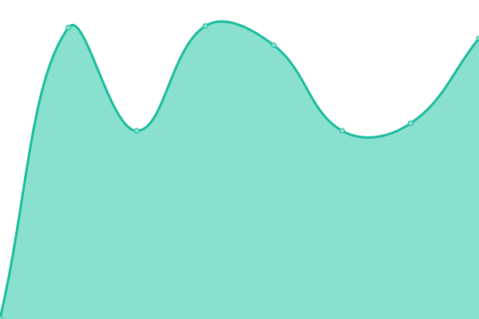
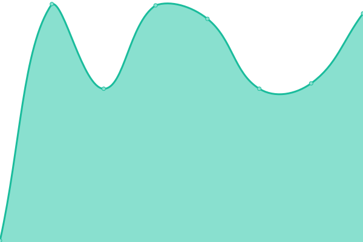

# [📈 Live Status](https://status.subspace.network): <!--live status--> **🟧 Partial outage**

This repository contains the open-source uptime monitor and status page for [subspace](https://subspace.network), powered by [Upptime](https://github.com/upptime/upptime).

With [Upptime](https://upptime.js.org), you can get your own unlimited and free uptime monitor and status page, powered entirely by a GitHub repository. We use [Issues](https://github.com/subspace/status/issues) as incident reports, [Actions](https://github.com/subspace/status/actions) as uptime monitors, and [Pages](https://status.subspace.network) for the status page.

<!--start: status pages-->
<!-- This summary is generated by Upptime (https://github.com/upptime/upptime) -->
<!-- Do not edit this manually, your changes will be overwritten -->
<!-- prettier-ignore -->
| URL | Status | History | Response Time | Uptime |
| --- | ------ | ------- | ------------- | ------ |
|  [Gemini-3g RPC-0 (US) endpoint](rpc-0.gemini-3g.subspace.network) | 🟩 Up | [gemini-3g-rpc-0-us-endpoint.yml](https://github.com/subspace/status/commits/HEAD/history/gemini-3g-rpc-0-us-endpoint.yml) | 

 60ms
     
 | 

<a href="https://status.subspace.network/history/gemini-3g-rpc-0-us-endpoint">100.00%</a>
    

|  [Gemini-3g RPC-1 (EU) endpoint](rpc-1.gemini-3g.subspace.network) | 🟩 Up | [gemini-3g-rpc-1-eu-endpoint.yml](https://github.com/subspace/status/commits/HEAD/history/gemini-3g-rpc-1-eu-endpoint.yml) | 

 170ms
     
 | 

<a href="https://status.subspace.network/history/gemini-3g-rpc-1-eu-endpoint">100.00%</a>
    

|  [Gemini-3g Nova RPC endpoint](nova.gemini-3g.subspace.network) | 🟩 Up | [gemini-3g-nova-rpc-endpoint.yml](https://github.com/subspace/status/commits/HEAD/history/gemini-3g-nova-rpc-endpoint.yml) | 

 36ms
     
 | 

<a href="https://status.subspace.network/history/gemini-3g-nova-rpc-endpoint">100.00%</a>
    

|  [Gemini-3g Nova Block Explorer endpoint](nova.subspace.network) | 🟩 Up | [gemini-3g-nova-block-explorer-endpoint.yml](https://github.com/subspace/status/commits/HEAD/history/gemini-3g-nova-block-explorer-endpoint.yml) | 

 49ms
     
 | 

<a href="https://status.subspace.network/history/gemini-3g-nova-block-explorer-endpoint">100.00%</a>
    

|  [Gemini-3g block explorer squid GraphQL endpoint](https://squid.gemini-3g.subspace.network/graphql) | 🟥 Down | [gemini-3g-block-explorer-squid-graph-ql-endpoint.yml](https://github.com/subspace/status/commits/HEAD/history/gemini-3g-block-explorer-squid-graph-ql-endpoint.yml) | 

 98ms
     
 | 

<a href="https://status.subspace.network/history/gemini-3g-block-explorer-squid-graph-ql-endpoint">100.00%</a>
    

|  [Gemini-3g block explorer squid Postgres database](https://squid.gemini-3g.subspace.network/db-health) | 🟥 Down | [gemini-3g-block-explorer-squid-postgres-database.yml](https://github.com/subspace/status/commits/HEAD/history/gemini-3g-block-explorer-squid-postgres-database.yml) | 

 28ms
     
 | 

<a href="https://status.subspace.network/history/gemini-3g-block-explorer-squid-postgres-database">99.80%</a>
    

|  [Gemini-3g block explorer squid Processor service](https://squid.gemini-3g.subspace.network/processor-health) | 🟥 Down | [gemini-3g-block-explorer-squid-processor-service.yml](https://github.com/subspace/status/commits/HEAD/history/gemini-3g-block-explorer-squid-processor-service.yml) | 

 31ms
     
 | 

<a href="https://status.subspace.network/history/gemini-3g-block-explorer-squid-processor-service">77.99%</a>
    

|  [Gemini-3g Nova block explorer squid GraphQL endpoint](https://nova.squid.gemini-3g.subspace.network/graphql) | 🟩 Up | [gemini-3g-nova-block-explorer-squid-graph-ql-endpoint.yml](https://github.com/subspace/status/commits/HEAD/history/gemini-3g-nova-block-explorer-squid-graph-ql-endpoint.yml) | 

 413ms
     
 | 

<a href="https://status.subspace.network/history/gemini-3g-nova-block-explorer-squid-graph-ql-endpoint">100.00%</a>
    

|  [Gemini-3g Nova block explorer squid Postgres database](https://nova.squid.gemini-3g.subspace.network/db-health) | 🟩 Up | [gemini-3g-nova-block-explorer-squid-postgres-database.yml](https://github.com/subspace/status/commits/HEAD/history/gemini-3g-nova-block-explorer-squid-postgres-database.yml) | 

 170ms
     
 | 

<a href="https://status.subspace.network/history/gemini-3g-nova-block-explorer-squid-postgres-database">100.00%</a>
    

|  [Gemini-3g Nova block explorer squid Processor service](https://nova.squid.gemini-3g.subspace.network/processor-health) | 🟩 Up | [gemini-3g-nova-block-explorer-squid-processor-service.yml](https://github.com/subspace/status/commits/HEAD/history/gemini-3g-nova-block-explorer-squid-processor-service.yml) | 

 132ms
     
 | 

<a href="https://status.subspace.network/history/gemini-3g-nova-block-explorer-squid-processor-service">100.00%</a>
    

|  [Gemini-3g Nova Subsquid archive GraphQL endpoint](https://nova.archive.gemini-3g.subspace.network/graphql?query=%7B__typename%7D) | 🟩 Up | [gemini-3g-nova-subsquid-archive-graph-ql-endpoint.yml](https://github.com/subspace/status/commits/HEAD/history/gemini-3g-nova-subsquid-archive-graph-ql-endpoint.yml) | 

 462ms
     
 | 

<a href="https://status.subspace.network/history/gemini-3g-nova-subsquid-archive-graph-ql-endpoint">100.00%</a>
    

|  [Gemini-3g Nova Subsquid archive Postgres database](https://nova.archive.gemini-3g.subspace.network/db-health) | 🟩 Up | [gemini-3g-nova-subsquid-archive-postgres-database.yml](https://github.com/subspace/status/commits/HEAD/history/gemini-3g-nova-subsquid-archive-postgres-database.yml) | 

 172ms
     
 | 

<a href="https://status.subspace.network/history/gemini-3g-nova-subsquid-archive-postgres-database">100.00%</a>
    

|  [Gemini-3g Nova Subsquid archive Ingest service](https://nova.archive.gemini-3g.subspace.network/ingest-health) | 🟩 Up | [gemini-3g-nova-subsquid-archive-ingest-service.yml](https://github.com/subspace/status/commits/HEAD/history/gemini-3g-nova-subsquid-archive-ingest-service.yml) | 

 133ms
     
 | 

<a href="https://status.subspace.network/history/gemini-3g-nova-subsquid-archive-ingest-service">100.00%</a>
    

|  [Gemini-3g Nova archive API endpoint](https://nova.archive.gemini-3g.subspace.network/api) | 🟩 Up | [gemini-3g-nova-archive-api-endpoint.yml](https://github.com/subspace/status/commits/HEAD/history/gemini-3g-nova-archive-api-endpoint.yml) | 

 133ms
     
 | 

<a href="https://status.subspace.network/history/gemini-3g-nova-archive-api-endpoint">100.00%</a>
    

|  [Gemini-3f RPC-1 (EU) endpoint](rpc-1.gemini-3f.subspace.network) | 🟩 Up | [gemini-3f-rpc-1-eu-endpoint.yml](https://github.com/subspace/status/commits/HEAD/history/gemini-3f-rpc-1-eu-endpoint.yml) | 

 142ms
     
 | 

<a href="https://status.subspace.network/history/gemini-3f-rpc-1-eu-endpoint">100.00%</a>
    

<!--end: status pages-->

[**Visit our status website →**](https://status.subspace.network)

## 📄 License

- Powered by: [Upptime](https://github.com/upptime/upptime)
- Code: [MIT](./LICENSE) © [subspace](https://subspace.network)
- Data in the `./history` directory: [Open Database License](https://opendatacommons.org/licenses/odbl/1-0/)
