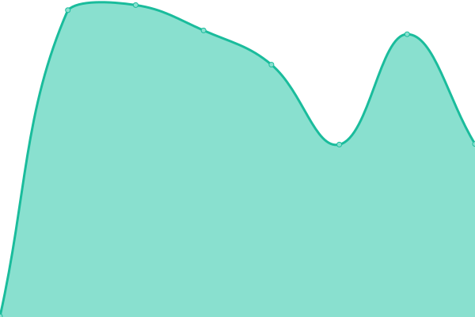
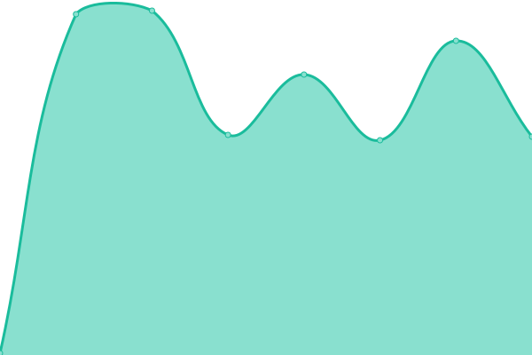
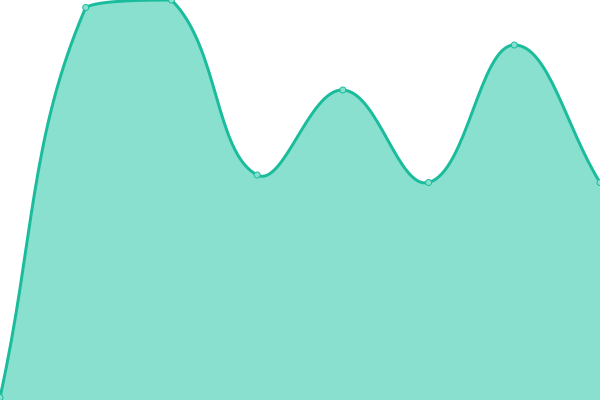
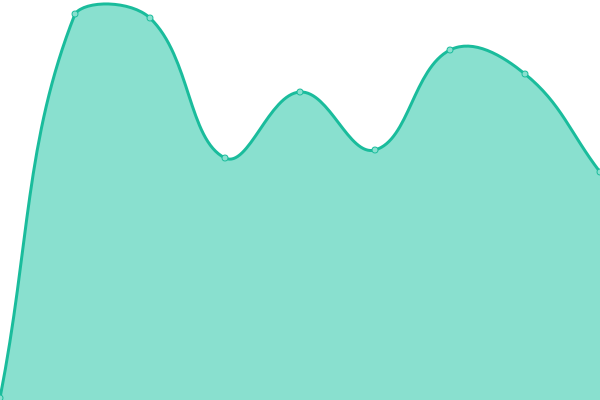
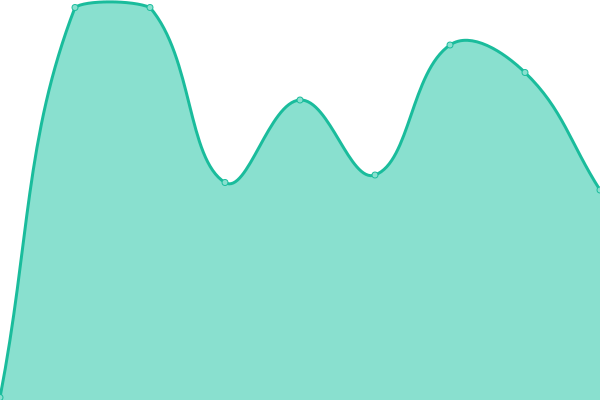
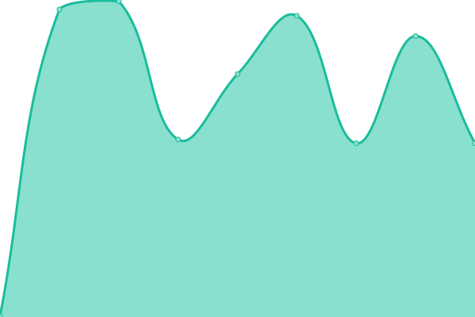
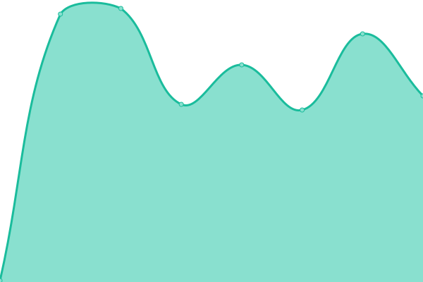
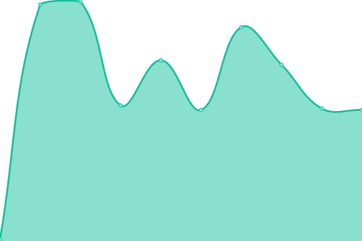

# [📈 Live Status](https://status.subspace.network): <!--live status--> **🟧 Partial outage**

This repository contains the open-source uptime monitor and status page for [subspace](https://subspace.network), powered by [Upptime](https://github.com/upptime/upptime).

With [Upptime](https://upptime.js.org), you can get your own unlimited and free uptime monitor and status page, powered entirely by a GitHub repository. We use [Issues](https://github.com/subspace/status/issues) as incident reports, [Actions](https://github.com/subspace/status/actions) as uptime monitors, and [Pages](https://status.subspace.network) for the status page.

<!--start: status pages-->
<!-- This summary is generated by Upptime (https://github.com/upptime/upptime) -->
<!-- Do not edit this manually, your changes will be overwritten -->
<!-- prettier-ignore -->
| URL | Status | History | Response Time | Uptime |
| --- | ------ | ------- | ------------- | ------ |
|  [Subspace Labs Website](https://www.subspace.network) | 🟩 Up | [subspace-labs-website.yml](https://github.com/subspace/status/commits/HEAD/history/subspace-labs-website.yml) | 

 328ms
     
 | 

<a href="https://status.subspace.network/history/subspace-labs-website">100.00%</a>
    

|  [Gemini-II EU-0 RPC endpoint](eu-0.gemini-2a.subspace.network) | 🟩 Up | [gemini-ii-eu-0-rpc-endpoint.yml](https://github.com/subspace/status/commits/HEAD/history/gemini-ii-eu-0-rpc-endpoint.yml) | 

 148ms
     
 | 

<a href="https://status.subspace.network/history/gemini-ii-eu-0-rpc-endpoint">100.00%</a>
    

|  [Gemini-III EU-0 RPC endpoint](eu-0.gemini-3c.subspace.network) | 🟩 Up | [gemini-iii-eu-0-rpc-endpoint.yml](https://github.com/subspace/status/commits/HEAD/history/gemini-iii-eu-0-rpc-endpoint.yml) | 

 147ms
     
 | 

<a href="https://status.subspace.network/history/gemini-iii-eu-0-rpc-endpoint">100.00%</a>
    

|  [Gemini-III EU-1 RPC endpoint](eu-1.gemini-3c.subspace.network) | 🟩 Up | [gemini-iii-eu-1-rpc-endpoint.yml](https://github.com/subspace/status/commits/HEAD/history/gemini-iii-eu-1-rpc-endpoint.yml) | 

 139ms
     
 | 

<a href="https://status.subspace.network/history/gemini-iii-eu-1-rpc-endpoint">100.00%</a>
    

|  [Gemini-II block explorer squid GraphQL endpoint](https://squid.gemini-2a.subspace.network/graphql?query=%7B__typename%7D) | 🟩 Up | [gemini-ii-block-explorer-squid-graph-ql-endpoint.yml](https://github.com/subspace/status/commits/HEAD/history/gemini-ii-block-explorer-squid-graph-ql-endpoint.yml) | 

 342ms
     
 | 

<a href="https://status.subspace.network/history/gemini-ii-block-explorer-squid-graph-ql-endpoint">100.00%</a>
    

|  [Gemini-II block explorer squid Postgres database](https://squid.gemini-2a.subspace.network/db-health) | 🟩 Up | [gemini-ii-block-explorer-squid-postgres-database.yml](https://github.com/subspace/status/commits/HEAD/history/gemini-ii-block-explorer-squid-postgres-database.yml) | 

 129ms
     
 | 

<a href="https://status.subspace.network/history/gemini-ii-block-explorer-squid-postgres-database">100.00%</a>
    

|  [Gemini-II block explorer squid Processor service](https://squid.gemini-2a.subspace.network/processor-health) | 🟥 Down | [gemini-ii-block-explorer-squid-processor-service.yml](https://github.com/subspace/status/commits/HEAD/history/gemini-ii-block-explorer-squid-processor-service.yml) | 

 96ms
     
 | 

<a href="https://status.subspace.network/history/gemini-ii-block-explorer-squid-processor-service">0.00%</a>
    

|  [Gemini-III block explorer squid GraphQL endpoint](https://squid.gemini-3c.subspace.network/graphql?query=%7B__typename%7D) | 🟩 Up | [gemini-iii-block-explorer-squid-graph-ql-endpoint.yml](https://github.com/subspace/status/commits/HEAD/history/gemini-iii-block-explorer-squid-graph-ql-endpoint.yml) | 

 304ms
     
 | 

<a href="https://status.subspace.network/history/gemini-iii-block-explorer-squid-graph-ql-endpoint">100.00%</a>
    

|  [Gemini-III block explorer squid Postgres database](https://squid.gemini-3c.subspace.network/db-health) | 🟩 Up | [gemini-iii-block-explorer-squid-postgres-database.yml](https://github.com/subspace/status/commits/HEAD/history/gemini-iii-block-explorer-squid-postgres-database.yml) | 

 129ms
     
 | 

<a href="https://status.subspace.network/history/gemini-iii-block-explorer-squid-postgres-database">100.00%</a>
    

|  [Gemini-III block explorer squid Processor service](https://squid.gemini-3c.subspace.network/processor-health) | 🟩 Up | [gemini-iii-block-explorer-squid-processor-service.yml](https://github.com/subspace/status/commits/HEAD/history/gemini-iii-block-explorer-squid-processor-service.yml) | 

 96ms
     
 | 

<a href="https://status.subspace.network/history/gemini-iii-block-explorer-squid-processor-service">100.00%</a>
    

|  [Gemini-III Subsquid archive GraphQL endpoint](https://archive.gemini-3c.subspace.network/graphql?query=%7B__typename%7D) | 🟩 Up | [gemini-iii-subsquid-archive-graph-ql-endpoint.yml](https://github.com/subspace/status/commits/HEAD/history/gemini-iii-subsquid-archive-graph-ql-endpoint.yml) | 

 308ms
     
 | 

<a href="https://status.subspace.network/history/gemini-iii-subsquid-archive-graph-ql-endpoint">100.00%</a>
    

|  [Gemini-III Subsquid archive Postgres database](https://archive.gemini-3c.subspace.network/db-health) | 🟩 Up | [gemini-iii-subsquid-archive-postgres-database.yml](https://github.com/subspace/status/commits/HEAD/history/gemini-iii-subsquid-archive-postgres-database.yml) | 

 130ms
     
 | 

<a href="https://status.subspace.network/history/gemini-iii-subsquid-archive-postgres-database">100.00%</a>
    

|  [Gemini-III Subsquid archive Ingest service](https://archive.gemini-3c.subspace.network/ingest-health) | 🟩 Up | [gemini-iii-subsquid-archive-ingest-service.yml](https://github.com/subspace/status/commits/HEAD/history/gemini-iii-subsquid-archive-ingest-service.yml) | 

 97ms
     
 | 

<a href="https://status.subspace.network/history/gemini-iii-subsquid-archive-ingest-service">100.00%</a>
    

|  [Gemini-III Subsquid archive API endpoint](https://archive.gemini-3c.subspace.network/api) | 🟩 Up | [gemini-iii-subsquid-archive-api-endpoint.yml](https://github.com/subspace/status/commits/HEAD/history/gemini-iii-subsquid-archive-api-endpoint.yml) | 

 98ms
     
 | 

<a href="https://status.subspace.network/history/gemini-iii-subsquid-archive-api-endpoint">100.00%</a>
    

<!--end: status pages-->

[**Visit our status website →**](https://status.subspace.network)

## 📄 License

- Powered by: [Upptime](https://github.com/upptime/upptime)
- Code: [MIT](./LICENSE) © [subspace](https://subspace.network)
- Data in the `./history` directory: [Open Database License](https://opendatacommons.org/licenses/odbl/1-0/)
